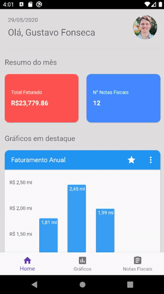

# Quantifico (Work in progress)

Quantifico is an app designed to grant the user valuable insights on their company. The data is presented in a visual manner through multiple kinds of plots, making it extremely simple to digest. There are currently a Mobile and Web client, both are still in development.

## Built Mainly With

**Server**
* [Node.js](https://nodejs.org/en/) - JavaScript interpreter
* [Express](https://github.com/expressjs/express) - Minimalist web framework
* [MongoDB](https://www.mongodb.com/) - NoSQL database
* [Mongoose](https://github.com/Automattic/mongoose) - Object mapper for MongoDB
* [Socket.io](https://github.com/socketio/socket.io) - Real time application framework
* [Joi](https://github.com/hapijs/joi) - Data validation library

**Mobile client**
* [Flutter](https://flutter.dev/) - Google’s UI toolkit for building natively compiled applications for mobile, web, and desktop.
* [Bloc](https://bloclibrary.dev/) - State management library
* [Charts Flutter](https://pub.dev/packages/charts_flutter) - Material Design data visualization library by Google.

**Web client**
* [Vue](https://github.com/vuejs/vue) - Front-end JavaScript framework
* [Vuetify](https://github.com/vuetifyjs/vuetify) -  Material component framework for Vue
* [Vue-Socket-io](https://github.com/MetinSeylan/Vue-Socket.io) - Socket.io implementation for Vue and Vuex 
* [Apex Charts](https://github.com/apexcharts/apexcharts.js) - Awesome ploting library
* [Vuex](https://github.com/vuejs/vuex) - Centralized state management for Vue.js

## DEMO

**Mobile Client**

## Disclaimer

This is not the official development repository, this repo is only used for potfolio. 